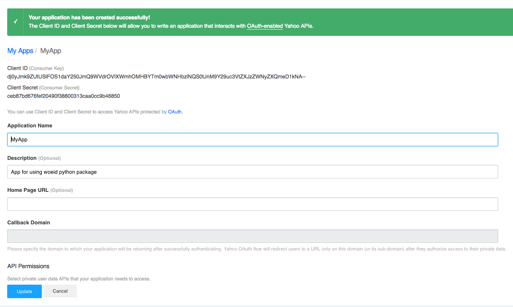
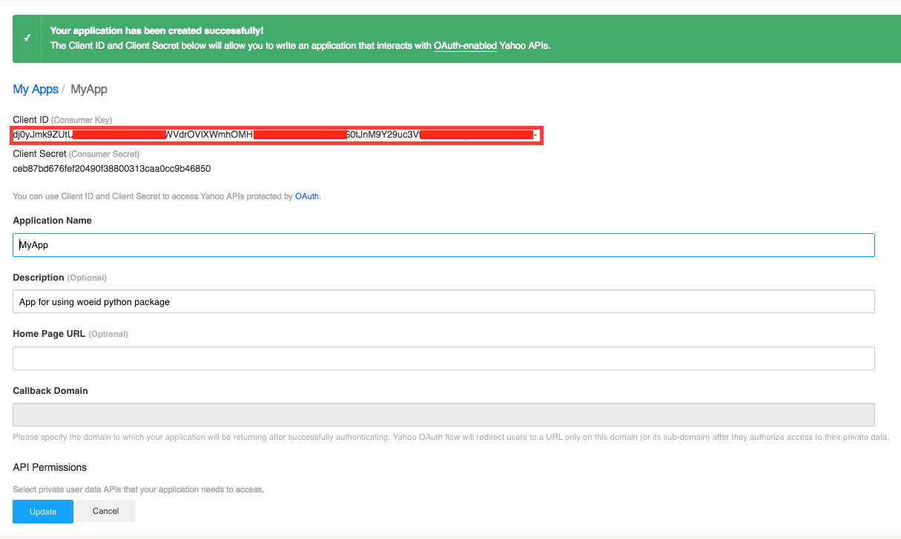

woied Python

Welcome to woeid's documentation!
---------------------------------
--A Python interface for Yahoo GeoPlanet Web Services REST APIs. Python 2 and 3 are all supported!--

.. image:: https://readthedocs.org/projects/woeid/badge/?version=latest
      :target: http://woeid.readthedocs.io/en/latest/?badge=latest
      :alt: Documentation Status

.. image:: https://requires.io/github/Ray-SunR/woeid/requirements.svg?branch=master
     :target: https://requires.io/github/Ray-SunR/woeid/requirements/?branch=master
     :alt: Requirements Status

+----------+-----------------------------------------+
|Author    | Renchen Sun                             |
+----------+-----------------------------------------+
|Email     | sunrenchen@gmail.com                    |
+----------+-----------------------------------------+
|Github    | https://github.com/Ray-SunR/            |
+----------+-----------------------------------------+
|LinkedIn  | https://ca.linkedin.com/in/renchensun   |
+----------+-----------------------------------------+

============
Introduction
============

This library provides a pure Python interface for the `Yahoo GeoPlanet API <https://developer.yahoo.com/geo/geoplanet/guide/>`_. It works with Python 2.7+ and Python 3.

Yahoo! GeoPlanetTM is designed to bridge the gap between the Real and Virtual worlds by providing the Internet with an open, comprehensive, and intelligent infrastructure for geo-referencing data on Earth’s surface.

In practical terms, Yahoo! GeoPlanet is a resource for managing all geo-permanent named places on earth. It provides the Geographic Developer Community with the vocabulary and grammar to describe the world's geography in an unequivocal, permanent, and language-neutral manner, and is designed to facilitate spatial interoperability and geographic discovery. Developers looking to geo-enable their applications can use GeoPlanet to traverse the spatial hierarchy, identify the geography relevant to their users and their business, and in turn, unambiguously geotag, geotarget, and geolocate data across the Web.

============
Installation
============

--From PyPI-- ::

    $ pip install woeid

--From source--

Download from pypi https://pypi.python.org/pypi/woeid/0.1.4

Download the latest `woeid` library from: https://github.com/Ray-SunR/woeid

Extract the source distribution and run::

    $ python setup.py install

================
Getting the code
================

The code is hosted at `Github` https://github.com/Ray-SunR/woeid

Check out the latest development version anonymously with::

$ git clone https://github.com/Ray-SunR/woeid.git
$ cd woeid

=======
Testing
=======

Navigate into test folder::

    $ cd test

and run::

    $ python test.py

===============================
Getting your application tokens
===============================

This section is subject to changes made by Yahoo and may not always be completely up-to-date. If you see something change on their end, please create a `new issue on Github <https://github.com/Ray-SunR/woeid/issues/new>`_ or submit a pull request to update it.

In order to use the woeid API client, you first need to acquire the consumer key. The ``consumer key`` will be required in order to create a ``woeid.Api`` object.

---------------
Create your app
---------------

The first step in doing so is to create a `Yahoo App <https://developer.yahoo.com/apps/>`_. Click the "Create an App" button and fill out the fields on the next page.

.. image:: docs/yahoo-app-creation-part1.png

If there are any problems with the information on that page, Yahoo will complain and you can fix it. (Make sure to get the name correct - it is unclear if you can change this later.) On the next screen, you'll see the application that you created and some information about it:

--------
Your app
--------

Once your app is created, you'll be directed to a new page showing you some information about it.

---------
Your Keys
---------

The stirng which is ecnlosed in red rectangle is your ``consumer key``.

At this point, you can test out your application using the ``consumer key`` to instantiate a ``woeid.Api(client_id=`YOUR_CLIENT_ID`)`` as follows::

    import woeid
    api = woeid.Api(client_id=[consumer_key])

========
Examples
========

-----------------------------------------
Example 1: Create an ``woeid`` api object
-----------------------------------------
::

    import woeid
    api = woeid.Api(client-id=`YOUR-CLIENT-ID`, select='long', format='xml')

    # Specify the requesting language
    api.Lang = 'zh-Hans'

    # Specify the view
    api.Select = 'short'

    # Set the response format
    api.Format = 'json'

    # Set the maximum number of records returned
    api.Count = 5

-------------------------------------------------------------------
Example 2: Retrieving the Most Likely Place for a Given Place Name'
-------------------------------------------------------------------

::

    woeid.PrettyPrintResult(api.GetPlaces(q='SFO'))

------------------------------------------------------------------------
Example 3: Retrieving the Five Most Likely Places for a Given Placename'
------------------------------------------------------------------------

::

    woeid.PrettyPrintResult(api.GetPlaces(q=u'中国'))

------------------------------------------------------------------------------
Example 4: Retrieving All Places for a Given ``place name`` and ``placetype``'
------------------------------------------------------------------------------

::

    woeid.PrettyPrintResult(api.GetPlaces(q='Long Island', typ=22, nd=True))

------------------------------------------------------------
Example 5: Retrieving Places That Have the Given ``woeids``'
------------------------------------------------------------

::

    woeid.PrettyPrintResult(api.GetPlaces(woeid=[2488042, 2488836, 2486340]))

------------------------------------------------------
Example 6: Retrieving a Place Using a Given ``woeid``'
------------------------------------------------------

::

    woeid.PrettyPrintResult(api.GetPlace(woeid=2507854))

-------------------------------------------------------------------------------
Example 7: Retrieving a Place with a Given ``woeid``, in `short` Representation
-------------------------------------------------------------------------------

::

    api.Select = 'short'
    woeid.PrettyPrintResult(api.GetPlace(woeid=2507854))

-----------------------------------------------------------------------------------------
Example 8: Retrieving the Parent Place of a Given ``woeid``, as a ``long`` Representation
-----------------------------------------------------------------------------------------

::

    api.Select = 'long'
    woeid.PrettyPrintResult(api.GetPlace(woeid=638242, parent=True))

----------------------------------------------------------
Example 9. Retrieving the Ancestors for a Given ``woeid``'
----------------------------------------------------------

::

    woeid.PrettyPrintResult(api.GetPlace(woeid=12587712, ancestors=True))

---------------------------------------------------------------------------
Example 10. Retrieving a Place That is a ``common`` Ancestor of Two Places'
---------------------------------------------------------------------------

::

    woeid.PrettyPrintResult(api.GetPlace(woeid=(2507854, 2380824), common=True))

---------------------------------------------------------------------------
Example 11. Retrieving a Place That is ``common`` Ancestor of Three Places'
---------------------------------------------------------------------------

::

    woeid.PrettyPrintResult(api.GetPlace(woeid=(2488042, 2488836, 2486340), common=True))

--------------------------------------
Example 12. Retrieving All Continents'
--------------------------------------

::

    woeid.PrettyPrintResult(api.GetContinents())

-------------------------------------------------------------------------
Example 13. Retrieving the Seas Adjacent to or Part of the Pacific Ocean'
-------------------------------------------------------------------------

::

   woeid.PrettyPrintResult(api.GetSeas(place='Pacific Ocean'))

---------------------------------------------------------------
Example 14. Retrieving the Countries Within North America (NA)'
---------------------------------------------------------------

::

    woeid.PrettyPrintResult(api.GetCountries(place='NA'))

----------------------------------------------------------------
Example 15. Retrieving the States Within the United States (US)'
----------------------------------------------------------------

::

    woeid.PrettyPrintResult(api.GetStates(country='US'))

-------------------------------------------------------
Example 16. Retrieving the Districts of Greater London'
-------------------------------------------------------

::

    woeid.PrettyPrintResult(api.GetDistricts(county='Greater London'))

--------------------------------------------------------------------
Example 17. Retrieving the WOEID and FIPs Code for a Given ISO Code'
--------------------------------------------------------------------

::

    woeid.PrettyPrintResult(api.GetConcordance(namespace='iso', id='CA-BC'))

-----------------------------------------------------------
Example 18. Retrieving a Partial Collection of Place Types'
-----------------------------------------------------------

::

    woeid.PrettyPrintResult(api.GetPlacetypes(typ=[0,2,22,37,38,15,16]))

About me
========

.. image:: favicon1.gif

Hello! My name is Renchen. I am a 24-year-old Full-Stack Software Developer from Vancouver BC, Canada.

I consider myself:

	- A heavy ``vimer``

	- A	command line lover

	- Most capable of ``C/C++`` and ``Python`` programming. Also capable of programming in ``Java``, ``Javascript``, ``C#``, ``ObjC``

	- Comfortable writing portable codes for different platforms (``Windows``, ``Linux``, ``MacOS``, ``iOS``, ``Android``)

	- Passionate about server-side development (``Node``, ``Meteor``)

	- An expert in ``OpenXml`` standards
