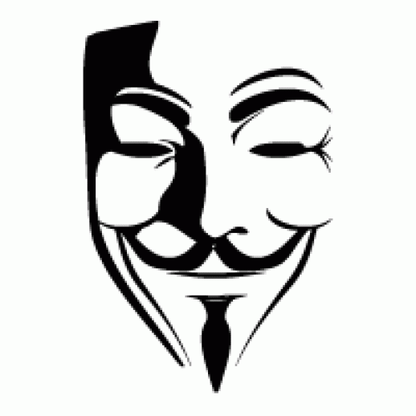

About me
========

Hello! My name is Renchen. I am a 24-year-old Full-Stack Software Developer from Vancouver BC, Canada.

I consider myself:

	- A heavy ``vimer``

 	- A	command line lover

 	- Most capable of ``C/C++`` and ``Python`` programming. Also capable of programming in Java, Javascript, C#, ObjC

 	- Comfortable writing portable codes for different platforms (``Windows``, ``Linux``, ``MacOS``, ``iOS``, ``Android``)

 	- Passionate about server-side development (``Node``, ``Meteor``)

 	- An expert in ``OpenXml`` standards
